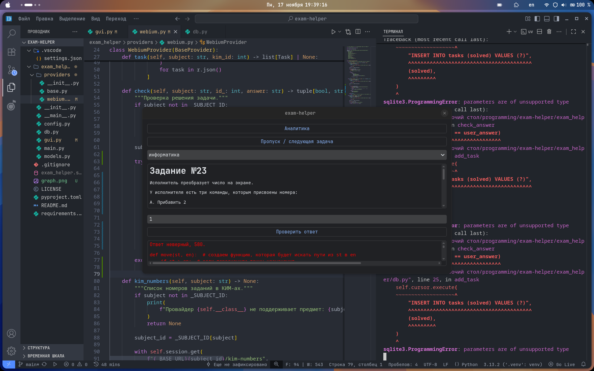
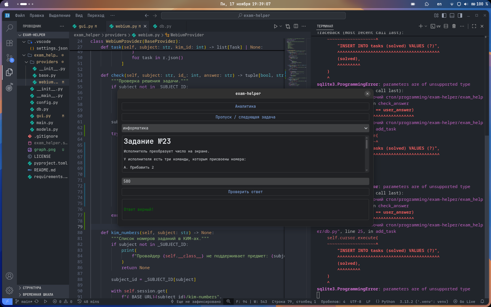
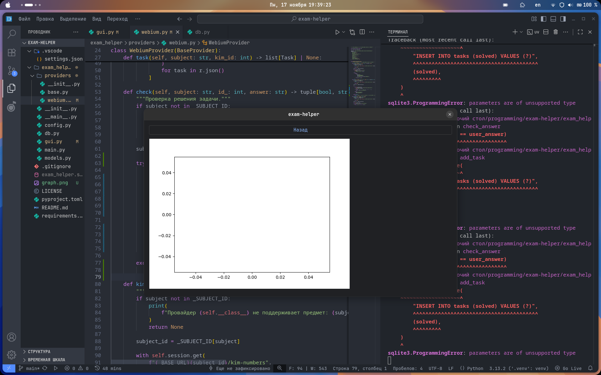

# exam-helper

### Локальный запуск

1. **Клонируем репозиторий:**

``` bash
git clone https://github.com/iamlostshit/exam-helper
```

2. **Переходим в дирректорию с проектом:**

``` bash
cd exam-helper
```

3. **Устанавливаем зависимости и запускаем бота:**

<details>
<summary>
Через uv (рекомендуется)
</summary>

**Устанавливаем `uv` (если еще не установлен):**

Linux:

``` bash
curl -LsSf https://astral.sh/uv/install.sh | sh
```

Windows:

``` bash
powershell -ExecutionPolicy ByPass -c "irm https://astral.sh/uv/install.ps1 | iex"
```

**Запускаем:**

```bash
uv run -m task_helper
```

</details>

<details>
<summary>
Через `requirements.txt`
</summary>

**Создаём виртуальное окружение:**

``` bash
python3 -m venv venv
```

**Активируем виртуальное окружение:**

``` bash
. venv/bin/activate
```

> Последняя команда для Windows:
>
> ``` bash
> venv\Scripts\activate
> ```

**Устанавливаем зависимости:**

``` bash
pip3 install -r requirements.txt
```

**Запускаем бота:**

``` bash
python3 -m task_helper
```
</details>

### Структура проекта

```
.gitignore            | Исключения для git.
pyproject.toml        | Конфиг, uv, ruff.
README.md             | Пояснительная записка.
.vscode/settings.json | Настройки IDE.
LICENSE               | Лицензия.
```

### О дизайне интерфейса

Изначально плаировалось сделать стандартную систему экранов, как в большинстве мобильных приложений/сайтов, сделать 3 раздела-экрана:

- `Главный` (на которой будут расположены подборки заданий).
- `Экран решения` задачи.
- `Статистики обучения` экран настроек/получения.

Но в процессе разработки было принято решение уйти от этой системы, в сторону минимализма.

Логично, что в более минималистичном приложени будет легче разобраться пользователю.

### Скриншоты







